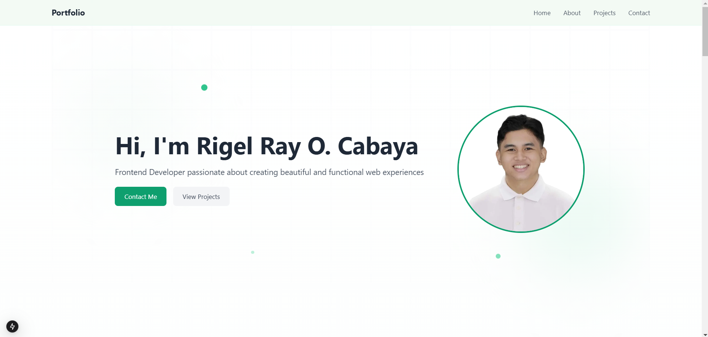

# Personal Portfolio Website

A modern, responsive portfolio website built with Next.js and Tailwind CSS. The website features a clean, minimalist design with interactive elements and smooth animations.



## 🌟 Features

- Responsive design that works on all devices
- Smooth scroll navigation
- Interactive project cards with modal details
- Contact form integration with Formspree
- Animated components and transitions
- Modern glassmorphism UI effects

## 🛠 Technologies Used

- **Framework:** Next.js 14
- **Styling:** Tailwind CSS
- **UI Components:** Flowbite React
- **Animations:**
  - Framer Motion
- **Form Handling:** Formspree
- **Deployment:** Github pages

## 🚀 Getting Started

### Prerequisites

- Node.js 18+
- npm or yarn

### Installation

1. Clone the repository

```bash
git clone https://github.com/yourusername/portfolio.git
cd portfolio
```

2. Install dependencies

```bash
npm install
```

3. Start the development server

```bash
npm run dev
```

The app will be available at [http://localhost:3000](http://localhost:3000)

### Environment Variables

Create a `.env.local` file in the root directory:

```env
NEXT_PUBLIC_FORMSPREE_ENDPOINT=your_formspree_endpoint
```
